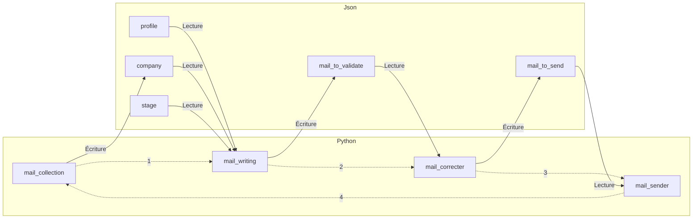

# ChercheurDeTaff

## Sommaire

- [ChercheurDeTaff](#chercheurdetaff)
  - [Sommaire](#sommaire)
  - [Introduction](#introduction)
  - [Fonctionnement](#fonctionnement)
    - [Relève du courrier](#relève-du-courrier)
    - [Rédaction du courrier](#rédaction-du-courrier)
    - [Correction du courrier](#correction-du-courrier)
    - [Envoie du courrier](#envoie-du-courrier)
  - [Structure des fichiers Json](#structure-des-fichiers-json)
    - [Le profile du candidat](#le-profile-du-candidat)
    - [Les entreprise démarchées](#les-entreprise-démarchées)
    - [Les étatpe de recrutement](#les-étatpe-de-recrutement)
    - [Les mails à corriger et envoyer](#les-mails-à-corriger-et-envoyer)

## Introduction

Routine de relance dans le cadre de la recherche d'emploi à partir d'un fichier JSON contenant les informations de l'entreprise en cours de démarchage et d'une base de données expliquant les différentes étapes jusqu'à l'embauche. Le programme est capable de relancer et d'entretenir la discussion avec l'interlocuteur de manière autonome. Il accomplit notamment les actions suivantes :

- **Relance automatique en cas de non-réponse** : en cas de réponse, il arrête la relance et passe l'entreprise en statut "waiting", signifiant qu'on attend une interaction de ma part. Il rédige automatiquement tous les e-mails, mais demande une confirmation avant de les envoyer.
- **Interfaces graphiques sommaires** accessibles depuis le port Web de la Raspberry.
- **Fichier de log pour Pôle emploi**.

Pour fonctionner, le programme a besoin d'un fichier `key.py` qui doit être conçu comme suit :

```python
_openAI_key_    = 'votre_api_key'
_mail_adresse_  = 'mail@mail.com'
_mail_password_ = 'votre_mot_de_passe_mail'
```

Le programme fonctionne grâce à 4 programmes Python qui sont exécutés via Cron :

- `mail_collection.py` est exécuté toutes les heures.
- `mail_writing.py` est exécuté une fois par jour.
- `mail_correcter.py` est exécuté à la demande de l'utilisateur.
- `mail_sender.py` est exécuté une fois par jour.

Ces programmes accomplissent leurs tâches respectives en fonction de leurs noms. Ainsi, le fichier `crontab` devrait ressembler à ceci :

```bash
# * * * * * chemin_vers_commande
# - - - - -
# | | | | |
# | | | | +----- Jour de la semaine (0 - 7) (Dimanche est à la fois 0 et 7)
# | | | +------- Mois (1 - 12)
# | | +--------- Jour du mois (1 - 31)
# | +----------- Heure (0 - 23)
# +------------- Minute (0 - 59)

0 * * * * /chemin/mail_collection.py
0 0 * * * /chemin/mail_writing.py
0 0 * * * /chemin/mail_to_send.py
```

## Fonctionnement

Pour éviter de surcharger la Raspberry Pi, je n'ai pas créé de programme Python fonctionnant en continu, mais ceux-ci sont appelés par un cron. Pour gérer et faire transiter les données d'une étape à une autre, j'utilise des fichiers JSON dédiés. Au total, il y en a cinq :

- `profile.json` (à venir pour gérer les profils en fonction des entreprises)
- `company.json`
- `stage.json`
- `mail_to_send.json`
- `mail_to_validate.json`

En supposant que tout se déroule correctement et en négligeant les différentes fréquences d'appel par cron des différents programmes, voici à quoi ressemblerait une exécution :



### Relève du courrier

### Rédaction du courrier

### Correction du courrier

### Envoie du courrier

## Structure des fichiers Json

Les différents structures de données sont stockée au format JSON pour sa simplicité d'utilisation et de modification à la volé. Ces données sont accesible via [data](data). Certain d'entre eux devront être parfois édité à la main donc voici leur structure.

### Le profile du candidat

TO DO :)  Permettra future ment de pouvoir gérer différents types de profil en fonction des différentes entreprises démarcher

### Les entreprise démarchées

 gère la liste des entreprises démarcher celle en cours de démarchage et celle pour lesquelles le démarchage est fini. Que la réponse était positive ou négative. Elle est structuré de la manière suivante

- **nom**: Le nom de l'entreprise (chaîne de caractères).
- **adresse**: L'adresse physique de l'entreprise (chaîne de caractères).
- **zipCode**: Le code postal de l'entreprise (nombre entier).
- **Ville**: La ville où se situe l'entreprise (chaîne de caractères).
- **mailDeContact**: Une liste d'adresses e-mail de contact pour l'entreprise. Car on peut prendre contact sur le mail contact de l'entreprise et avoir une réponse par l'intermédiaire de l'adresse directe du responsable des ressources humaines.
- **aPropos**: Des informations ou détails supplémentaires sur l'entreprise, Généralement le contenu de la page qui sommes-nous sur leur site Web suffit amplement. Le but de ce champ et de fournir des informations à ChatGPT pour qu'il puisse générer des réponses pertinentes voir des lettres de motivation pertinente. (chaîne de caractères).
- **historiqueDeMail**: Une liste d'objets représentant l'historique des e-mails associés à l'entreprise. Chaque objet a les attributs suivants :
  - **mailDestinataire**: L'adresse e-mail du destinataire du mail.
  - **mailExpediteur**: L'adresse e-mail de l'expéditeur du mail.
  - **sujet**: Le sujet du mail (chaîne de caractères).
  - **content**: Le contenu du mail (chaîne de caractères).
  - **phase**: La phase associée au mail. Les phases sont les différentes étapes du recrutement. C'est pour garder l'historique de savoir à quelle phase était associé ce mail.(chaîne de caractères).
  - **date**: La date d'envoi du mail (format "dd.mm.yyyy - hh:mm").
- **phase**: La phase actuelle de l'entreprise (chaîne de caractères).
- **active**: Un booléen indiquant si l'entreprise est active ou non. Si elle est active alors nous sommes dans une démarche de relance automatique, si elle est inactive ce que nous avons reçu une réponse.
- **travailAPourvoir**: Une liste des postes à pourvoir dans le but de générer des mails ou des messages elle est plus personnalisé et précis possible

 pour l'instant lorsque nous ajoutons une nouvelle entreprise à la liste il faut le faire manuellement à savoir fournir les informations sur le **nom** l'**adresse** le **zip code** la **ville** le **mail de contacts** le **à-propos** la **phase** sera forcément la première savoir si elle est **active** sera forcément oui et le **travail à pourvoir**

---

**Exemple Entreprise**

```JSON
{
    "nom": "Entreprise Exemple",
    "adresse": "Rue de l'exemple",
    "zipCode": 12345,
    "Ville": "Exemple",
    "mailDeContact": [
        "email1@example.com",
        "email2@example.com"
    ],
    "aPropos": "Lorem ipsum dolores si amet ...",
    "historiqueDeMail": [],
    "phase": "Opportunité",
    "active": true,
    "travailAPourvoir": [
        "Poste A",
        "Poste B"
    ]
}
```

Il n'y a aucun historique de mail car aucun échange n'a encore été fait. À noter que le programme détecte ça et génère automatiquement un mail de prise de contacts.

**Exemple Mail**

```JSON
{
    "mailDestinaire": "email1@example.com",
    "mailExpediteur": "email2@example.com",
    "sujet": "Sujet du mail",
    "content": "Lorem ipsum dolores si amet ...",
    "phase": "Opportunité",
    "date": "22.11.2023 - 12:20"
}
```

### Les étatpe de recrutement

### Les mails à corriger et envoyer
